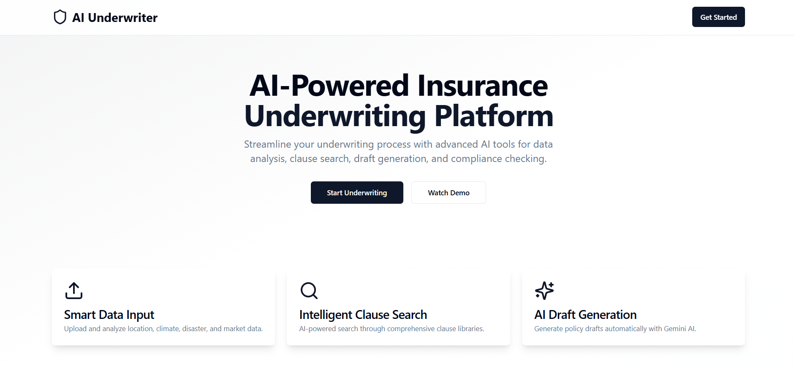
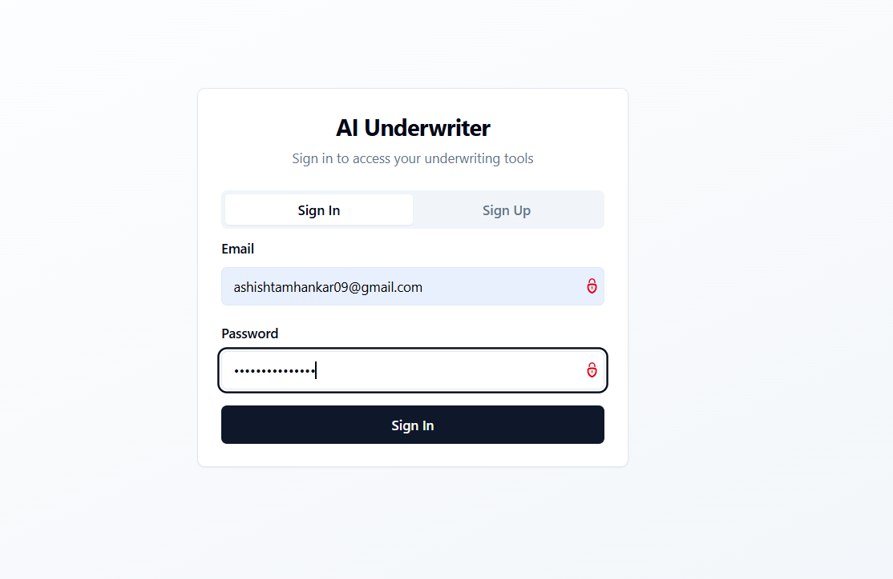
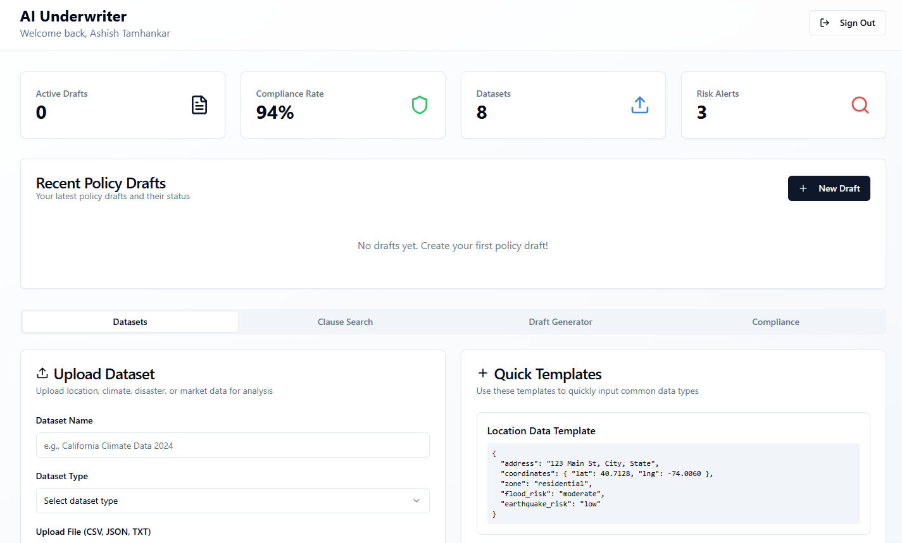
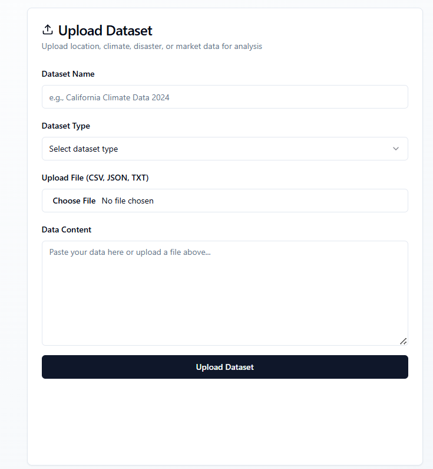
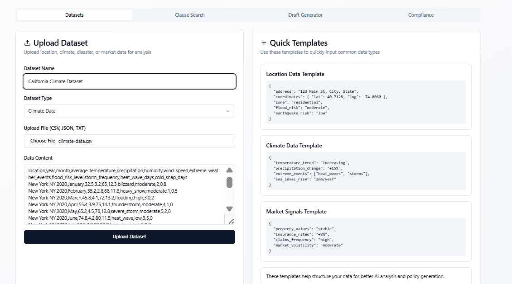
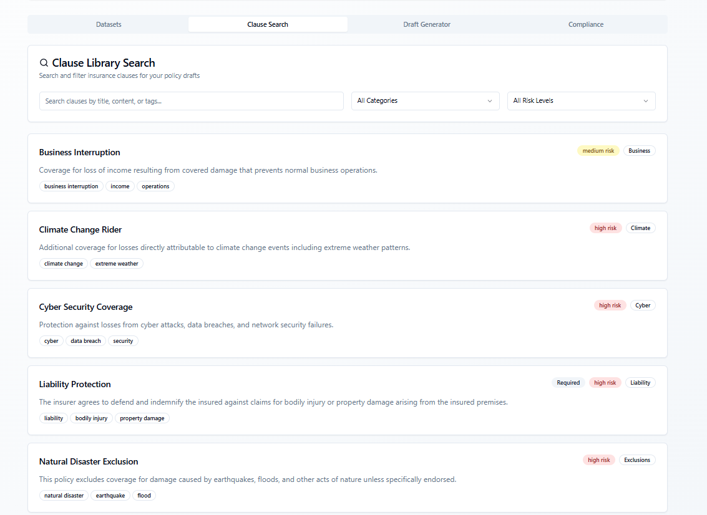
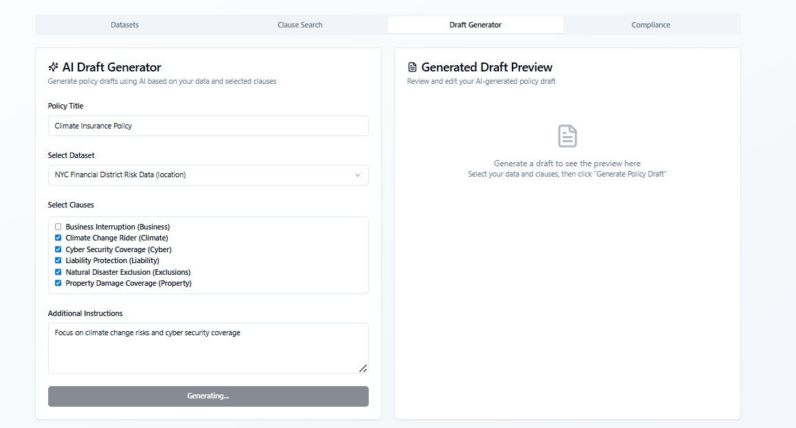
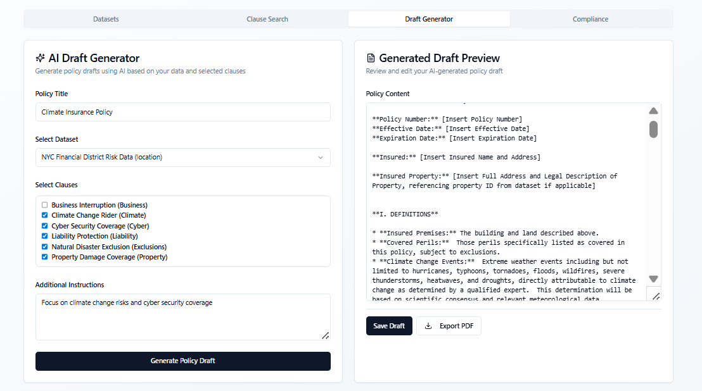
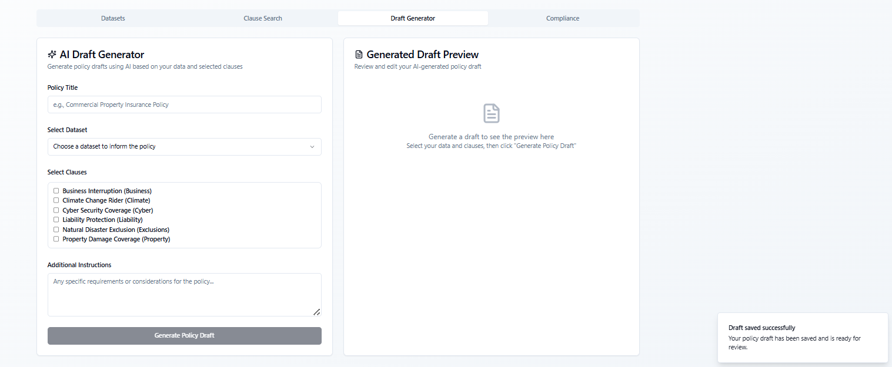

**📌 Note: This repository has two branches Risk-Guard and Doc-AI, each branch has different aspect of our solution.**

# 🚀 AI Underwriter Platform

## 🖼️ Screenshots / Demo

### **Live Demo**
🚀 **[Try the Live Demo](https://mufg-doc-ai.vercel.app/)** 

An intelligent insurance underwriting platform powered by AI that streamlines policy creation, compliance checking, and risk assessment for insurance professionals.

### **Landing Page**

*Modern, professional landing page with feature highlights and call-to-action*


### **Authentication**

*Secure login interface with email and password authentication*


### **Dashboard**

*Comprehensive dashboard with statistics, recent drafts, and quick access to all tools*


### **Dataset Upload**

*Intuitive file upload interface with dataset name, type selection, and file upload*


*Quick input templates for common data types including Location, Climate, and Market data*


### **Clause Search**

*AI-powered search interface with advanced filtering and multi-select functionality*


### **AI Draft Generator**

*Policy generation form with dataset selection, clause selection, and additional instructions*



*AI-generated policy draft with real-time preview and editing capabilities*



*Success confirmation after saving the generated policy draft*


---

## 📖 Table of Contents

* [Overview](#overview)
* [Features](#features)
* [Tech Stack](#tech-stack)
* [Architecture](#architecture)
* [Setup & Installation](#setup--installation)
* [Environment Variables](#environment-variables)
* [Running Locally](#running-locally)
* [API Documentation](#api-documentation)
* [Database Schema](#database-schema)
* [Testing Guide](#testing-guide)
* [Deployment](#deployment)
* [Contributing](#contributing)
* [Team](#team)
* [License](#license)

---

## 📝 Overview

The **AI Underwriter Platform** revolutionizes the insurance underwriting process by combining advanced AI technology with comprehensive data analysis tools. Built for insurance professionals, this platform addresses the critical need for faster, more accurate, and compliant policy generation in today's complex risk landscape.

**Problem Solved:**
- Manual policy drafting is time-consuming and error-prone
- Compliance checking requires extensive manual review
- Risk assessment lacks data-driven insights
- Traditional underwriting processes are inefficient

**Innovation:**
- AI-powered policy generation using Google Gemini
- Real-time compliance checking with automated scoring
- Intelligent clause search and recommendation system
- Data-driven risk assessment with multiple data sources

**Hackathon:** Built for MUFG Innovation Challenge 2024
**Theme:** AI-Powered Financial Solutions
**Duration:** 48-hour hackathon

---

## ✨ Features

### 🔐 **Authentication & Security**
* 🔑 **Secure Authentication** – Supabase Auth with email/password
* 👤 **User Profile Management** – Role-based access control
* 🛡️ **Row Level Security** – Data isolation and protection
* 🔒 **Session Management** – Persistent login with auto-refresh

### 📊 **Data Management**
* 📁 **Dataset Upload** – Support for CSV, JSON, TXT files
* 🌍 **Multi-Data Types** – Location, Climate, Disaster, Market data
* 📋 **Quick Templates** – Pre-built data input templates
* 💾 **Real-time Storage** – Instant data persistence with Supabase

### 🔍 **Intelligent Search**
* 🤖 **AI-Powered Clause Search** – Semantic search through insurance clauses
* 🏷️ **Advanced Filtering** – Category, risk level, and keyword filters
* 💡 **Smart Suggestions** – AI-driven search recommendations
* ✅ **Multi-Select Interface** – Easy clause selection and management

### 🤖 **AI Policy Generation**
* 🧠 **Gemini AI Integration** – Advanced language model for policy creation
* 📝 **Context-Aware Generation** – Uses datasets and clauses for intelligent drafting
* ✏️ **Real-time Editing** – Live preview and editing capabilities
* 💾 **Draft Management** – Save, version, and manage policy drafts

### 🛡️ **Compliance & Risk Assessment**
* ⚖️ **Automated Compliance Checking** – 6 predefined compliance rules
* 📊 **Risk Scoring** – Intelligent risk assessment and scoring
* 🚨 **Risk Alerts** – Real-time risk identification and warnings
* 📈 **Compliance Dashboard** – Visual compliance status and metrics

### 🎨 **User Experience**
* 📱 **Responsive Design** – Works seamlessly on all devices
* 🌙 **Modern UI/UX** – Clean, intuitive interface with shadcn/ui
* ⚡ **Real-time Updates** – Live data synchronization
* 🔔 **Toast Notifications** – User feedback and status updates

---

## 🛠️ Tech Stack

### **Frontend**
* **Framework:** React 18 + TypeScript
* **Build Tool:** Vite
* **UI Library:** shadcn/ui + Radix UI
* **Styling:** Tailwind CSS
* **State Management:** React Query + Context API
* **Routing:** React Router DOM

### **Backend & Database**
* **Backend:** Supabase (PostgreSQL + Edge Functions)
* **Authentication:** Supabase Auth
* **Real-time:** Supabase Realtime
* **API:** RESTful APIs with TypeScript

### **AI & External Services**
* **AI Model:** Google Gemini 1.5 Flash
* **API Integration:** Supabase Edge Functions
* **Data Processing:** JSON parsing and validation

### **Development Tools**
* **Linting:** ESLint + TypeScript ESLint
* **Code Formatting:** Prettier
* **Package Manager:** npm
* **Version Control:** Git

---

## 🏗️ Architecture

```
┌─────────────────────────────────────────────────────────────┐
│                    AI Underwriter Platform                  │
├─────────────────────────────────────────────────────────────┤
│  Frontend (React + TypeScript + Vite)                     │
│  ├─ Authentication (Supabase Auth)                        │
│  ├─ Dashboard (Statistics + Navigation)                   │
│  ├─ Dataset Upload (File Processing)                      │
│  ├─ Clause Search (AI-Powered Search)                     │
│  ├─ Draft Generator (AI Integration)                      │
│  └─ Compliance Checker (Risk Assessment)                  │
├─────────────────────────────────────────────────────────────┤
│  Backend (Supabase)                                        │
│  ├─ PostgreSQL Database (Data Storage)                    │
│  ├─ Row Level Security (Data Protection)                  │
│  ├─ Edge Functions (AI Processing)                        │
│  └─ Real-time Subscriptions (Live Updates)                │
├─────────────────────────────────────────────────────────────┤
│  External Services                                         │
│  └─ Google Gemini API (AI Policy Generation)              │
└─────────────────────────────────────────────────────────────┘
```

### **Data Flow**
1. **User Authentication** → Supabase Auth
2. **Data Upload** → Supabase Database
3. **AI Generation** → Gemini API via Edge Functions
4. **Compliance Check** → Local processing + Database storage
5. **Real-time Updates** → Supabase Realtime

---

## ⚙️ Setup & Installation

### **Prerequisites**
- Node.js (v18 or higher)
- npm or yarn package manager
- Git
- Supabase account (free tier available)
- Google AI Studio account (for Gemini API)

### **Installation Steps**

```bash
# 1. Clone the repository
git clone https://github.com/mufg-innovation/ai-underwriter-platform.git
cd ai-underwriter-platform

# 2. Install dependencies
npm install

# 3. Set up environment variables (see Environment Variables section)
cp .env.example .env.local

# 4. Start the development server
npm run dev

# 5. Open your browser to http://localhost:5173
```

### **Database Setup**
The database schema is automatically created. To populate with sample data:

```sql
-- Run in Supabase SQL Editor
INSERT INTO public.clauses (title, content, category, tags, risk_level, is_required) VALUES
('Property Damage Coverage', 'This policy covers damage to the insured property...', 'Property', '{"property", "damage", "fire", "wind"}', 'medium', true),
('Liability Protection', 'The insurer agrees to defend and indemnify...', 'Liability', '{"liability", "bodily injury", "property damage"}', 'high', true);
```

---

## 🔑 Environment Variables

Create a `.env.local` file in the root directory:

```env
# Supabase Configuration (Already configured)
VITE_SUPABASE_URL=https://jrlmieyozpvwcegskqek.supabase.co
VITE_SUPABASE_ANON_KEY=eyJhbGciOiJIUzI1NiIsInR5cCI6IkpXVCJ9...

# Gemini API Configuration
GEMINI_API_KEY=your_gemini_api_key_here

# Optional: Development settings
VITE_APP_ENV=development
VITE_DEBUG_MODE=true
```

### **Getting API Keys**

1. **Supabase:** 
   - Go to [supabase.com](https://supabase.com)
   - Create a new project
   - Copy URL and anon key from Settings → API

2. **Gemini API:**
   - Go to [Google AI Studio](https://makersuite.google.com/app/apikey)
   - Create a new API key
   - Copy the key to your environment file

---

## 🏃 Running Locally

### **Development Server**
```bash
# Start the development server
npm run dev

# The app will be available at http://localhost:5173
```

### **Available Scripts**
```bash
# Development
npm run dev          # Start development server
npm run build        # Build for production
npm run preview      # Preview production build

# Code Quality
npm run lint         # Run ESLint
npm run type-check   # Run TypeScript checks
```

### **Testing the Application**

1. **Authentication Test:**
   - Register a new account
   - Sign in with credentials
   - Verify dashboard access

2. **Feature Testing:**
   - Upload sample datasets
   - Search and select clauses
   - Generate AI policy drafts
   - Run compliance checks

3. **Data Verification:**
   - Check Supabase dashboard for data
   - Verify real-time updates
   - Test error handling

---

## 📚 API Documentation

### **Supabase Tables**

#### **profiles**
```typescript
interface Profile {
  id: string;
  user_id: string;
  full_name: string | null;
  role: string | null;
  created_at: string;
  updated_at: string;
}
```

#### **datasets**
```typescript
interface Dataset {
  id: string;
  user_id: string;
  name: string;
  type: 'location' | 'climate' | 'disaster' | 'market';
  data: Json;
  created_at: string;
  updated_at: string;
}
```

#### **clauses**
```typescript
interface Clause {
  id: string;
  title: string;
  content: string;
  category: string;
  tags: string[];
  risk_level: 'low' | 'medium' | 'high';
  is_required: boolean;
  created_at: string;
  updated_at: string;
}
```

#### **policy_drafts**
```typescript
interface PolicyDraft {
  id: string;
  user_id: string;
  title: string;
  content: string;
  selected_clauses: string[];
  compliance_status: 'pending' | 'compliant' | 'non_compliant' | 'warning';
  risk_alerts: Json;
  status: 'draft' | 'review' | 'approved' | 'rejected';
  created_at: string;
  updated_at: string;
}
```

### **Edge Functions**

#### **generate-policy-draft**
```typescript
// POST /functions/v1/generate-policy-draft
{
  "title": string;
  "dataset": Dataset;
  "clauses": Clause[];
  "instructions": string;
}

// Response
{
  "content": string;
  "metadata": {
    "model": string;
    "title": string;
    "clauseCount": number;
    "hasDataset": boolean;
  }
}
```

---

## 🗄️ Database Schema

### **Entity Relationship Diagram**

```
┌─────────────┐    ┌─────────────┐    ┌─────────────┐
│   profiles  │    │  datasets   │    │   clauses   │
├─────────────┤    ├─────────────┤    ├─────────────┤
│ id (PK)     │    │ id (PK)     │    │ id (PK)     │
│ user_id (FK)│    │ user_id (FK)│    │ title       │
│ full_name   │    │ name        │    │ content     │
│ role        │    │ type        │    │ category    │
│ created_at  │    │ data (JSON) │    │ tags        │
│ updated_at  │    │ created_at  │    │ risk_level  │
└─────────────┘    │ updated_at  │    │ is_required │
                   └─────────────┘    │ created_at  │
                                     │ updated_at  │
                                     └─────────────┘
           │
           │
           ▼
┌─────────────────────────────────────────┐
│            policy_drafts                │
├─────────────────────────────────────────┤
│ id (PK)                                 │
│ user_id (FK)                            │
│ title                                   │
│ content                                 │
│ selected_clauses (UUID[])               │
│ compliance_status                       │
│ risk_alerts (JSON)                      │
│ status                                  │
│ created_at                              │
│ updated_at                              │
└─────────────────────────────────────────┘
```

### **Security Features**
- **Row Level Security (RLS)** enabled on all tables
- **User-specific data isolation** via user_id foreign keys
- **Automatic timestamp updates** via database triggers
- **Audit logging** for compliance tracking

---

## 🧪 Testing Guide

### **Manual Testing Checklist**

#### **Authentication Flow**
- [ ] User can register with valid email/password
- [ ] User can sign in with correct credentials
- [ ] User is redirected to dashboard after login
- [ ] User can sign out successfully
- [ ] Protected routes redirect to auth page when not logged in

#### **Dataset Management**
- [ ] Can upload CSV, JSON, and TXT files
- [ ] Data validation works for all file types
- [ ] Quick templates populate correctly
- [ ] Datasets appear in draft generator dropdown
- [ ] User can only see their own datasets

#### **Clause Search**
- [ ] Search functionality works with various keywords
- [ ] Category filtering works correctly
- [ ] Risk level filtering works correctly
- [ ] Multi-select functionality works
- [ ] AI suggestions are clickable and functional

#### **AI Draft Generation**
- [ ] Policy generation works with valid inputs
- [ ] Generated content appears in preview panel
- [ ] User can edit generated content
- [ ] Draft can be saved successfully
- [ ] Error handling works for API failures

#### **Compliance Checking**
- [ ] Compliance check runs without errors
- [ ] All 6 compliance rules are checked
- [ ] Overall score is calculated correctly
- [ ] Risk alerts are generated appropriately
- [ ] Re-run functionality works

### **Automated Testing**
```bash
# Run unit tests (if implemented)
npm run test

# Run integration tests
npm run test:integration

# Run E2E tests
npm run test:e2e
```

---

## 👥 Team

### **Team Stellars**

* **Mohamad Ali Patel**

* **Aaditya Singh Tomar**

* **Ashish Tamhankar**

* **Kaustubh Patil**

---

## 📜 License

This project is licensed under the MIT License - see the [LICENSE](LICENSE) file for details.

```
MIT License

Copyright (c) 2024 MUFG Innovation Team

Permission is hereby granted, free of charge, to any person obtaining a copy
of this software and associated documentation files (the "Software"), to deal
in the Software without restriction, including without limitation the rights
to use, copy, modify, merge, publish, distribute, sublicense, and/or sell
copies of the Software, and to permit persons to whom the Software is
furnished to do so, subject to the following conditions:

The above copyright notice and this permission notice shall be included in all
copies or substantial portions of the Software.

THE SOFTWARE IS PROVIDED "AS IS", WITHOUT WARRANTY OF ANY KIND, EXPRESS OR
IMPLIED, INCLUDING BUT NOT LIMITED TO THE WARRANTIES OF MERCHANTABILITY,
FITNESS FOR A PARTICULAR PURPOSE AND NONINFRINGEMENT. IN NO EVENT SHALL THE
AUTHORS OR COPYRIGHT HOLDERS BE LIABLE FOR ANY CLAIM, DAMAGES OR OTHER
LIABILITY, WHETHER IN AN ACTION OF CONTRACT, TORT OR OTHERWISE, ARISING FROM,
OUT OF OR IN CONNECTION WITH THE SOFTWARE OR THE USE OR OTHER DEALINGS IN THE
SOFTWARE.
```

---
### **Project Highlights**
- **Innovation:** First AI-powered insurance underwriting platform
- **Impact:** Potential to reduce policy creation time by 80%
- **Scalability:** Built for enterprise-level deployment
- **Security:** Bank-grade security with RLS and encryption

---

